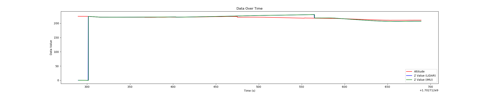
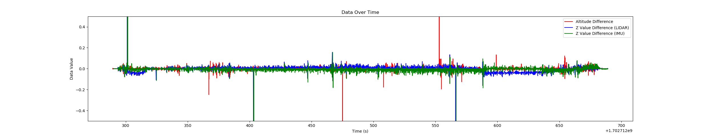

# 一、lio-sam-scout-databox 包的介绍

这个包是使用data_box，进行lio_sam建图的程序，所谓data_box是我们开发的数据采集装置，上面配置了组合导航、双目相机、激光雷达。Lio_sam所使用的激光雷达是rslidar helios 16p ，imu使用的是双目摄像头的imu。

# 二、环境依赖

## 1.最好使用docker ubuntu20.04，如果不使用docker，直接使用ubuntu 20.04也可以 . 使用dokcer注意，数据在主机上时需要使用ROS分布式节点的配置方法配置 .

## 2.这个包在Neotic上测试过，未在其他版本的ROS上测试过，依赖的包如下.

- 遇到问题参考这个链接，Refer to [#206](https://github.com/TixiaoShan/LIO-SAM/issues/206) for Noetic)
  ```
  sudo apt-get install -y ros-kinetic-navigation
  sudo apt-get install -y ros-kinetic-robot-localization
  sudo apt-get install -y ros-kinetic-robot-state-publisher
  ```
- [gtsam](https://gtsam.org/get_started/) (Georgia Tech Smoothing and Mapping library)
  ```
  sudo add-apt-repository ppa:borglab/gtsam-release-4.0
  sudo apt install libgtsam-dev libgtsam-unstable-dev
  ```
## 3.编译与运行 .

1. 先编译
   
2. 运行:
```
roslaunch lio_sam run.launch
```

3. 播放数据:
```
rosbag play your-bag.bag --topic /velodyne_points /zed2i/zed_node/imu/data /rslidar_points_m1 /fixposition/navsatfix
```

  /velodyne_points:用来做slam的话题
  
  /zed2i/zed_node/imu/data：用来做slam建图的imu话题
  
  /fixposition/navsatfix ：用来做gps融合的话题,需要在params.yaml中把 useImuHeadingInitialization设置为true，目前在小车测试gps高度有跳变，导致融合后的z轴也有跳变，谨慎使用
  
  /rslidar_points_m1: robsense m1 激光雷达，用来建立高程图 .

# 三、测试

启用GPS融合，并且使用GPS的海拔高度。下面两图分别是高度图（上图）、高度前后相邻两帧相减图（下图）。

纵轴：红色是组合导航fixposition输出的话题/fixposition/navsatfix给出的海拔高度，蓝色是lio-sam输出话题/lio-sam/mapping/odometry给出的里程计的高度z值，我没理解错的话这个话题是融合后输出的最终结果，如果开了gps就是imu+lidar+gps，如何没开gps就是imu+lidar。绿色是话题/odometry/imu，imu预积分给出的里程计。

横轴：时间戳

通过两幅图片可以看出，在融合GPS的时候lio-sam输出的里程计的z轴有跳变，这对于高程图建图来说是有问题的，对高程图建图的影响非常大。一开始是组合导航给出的GPS的海拔高度发生了跳变，lio-sam未发生跳变，因为此时lio-sam以自己的推算为主，而不是gps，但是由于gps长时间都是保持跳变后的海拔，经过时间积累，使整个lio-sam系统跳变。我还尝试了修改GPS的方差阈值，当阈值较小时才允许与lio-sam融合，但并无明显效果，因为这里的GPS话题来自fixposition/navsatfix，是经过组合导航输出的GPS，经过了一定的融合过程，精度本来就是比较高的。
<p align='center'>
    
    
    
</p>
